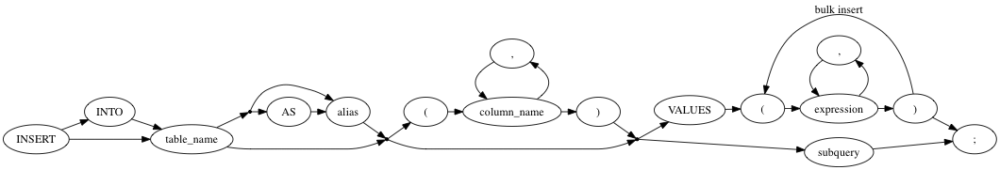
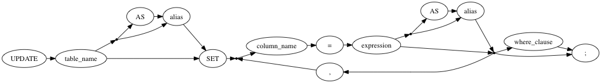

# Bolt

The wrapper for using INSERT/UPDATE/DELETE sql query on Google Cloud Spanner.

### INSERT/UPDATE/DELETE

#### INSERT


#### UPDATE


#### DELETE


## How to use

### In Scala,

Describe library dependency to .sbt file

```
libraryDependencies += "com.sopranoworks" %% "bolt" % "0.12-SNAPSHOT"
```
NOTICE: Bolt currently is not registered to any maven repository.

And then,

```scala
import Bolt._

dbClinet.executeQuery("INSERT INTO test_tbl01 VALUES(103,'test insert');")
```

It uses implicit conversion.

You can use it as explicitly like this.

```scala
Nat(dbClient).executeQuery("INSERT INTO test_tbl01 VALUES(103,'test insert');")

```

Transaction query is able to be described as

```scala
dbClient.beginTransaction {
  tr =>
    tr.executeQuery("INSERT INTO test_tbl01 VALUES(103,'test insert');")
}
```


#### Other functions

ResultSet is able to be used as Iterator

```scala
dbClient.executeQuery("SELECT * FROM test_tbl01").map {
  resultSet =>
    (resultSet.getString("id"),resultSet.getString("name"))
}
```

And also

```scala
dbClient.executeQuery("SELECT * FROM test_tbl01").headOption
```

You can use ResultSet safely as like this.

```scala
dbClient.executeQuery("SELECT * FROM test_tbl01").autoclose(
  resultSet =>
      ...
)
```


### In Java,

```java
import com.sopranoworks.bolt.Bolt;

Bolt.Nat nat = Bolt.Nat(client);
nat.executeQuery("INSERT INTO TEST_TABLE (ID,NAME) VALUES(101,'test');");
```

### Notice

A Nat instance is not thread safe.
You must create a instance per thread.


## Limitations

* Bytes type is currently not supported in INSERT/UPDATE query 
* Only few functions are usable in INSERT/UPDATE query
* CASE Conditional expression is currently not supported in INSERT/UPDATE query

There is no such a limitation in SELECT and subquery.

## Licence

MIT